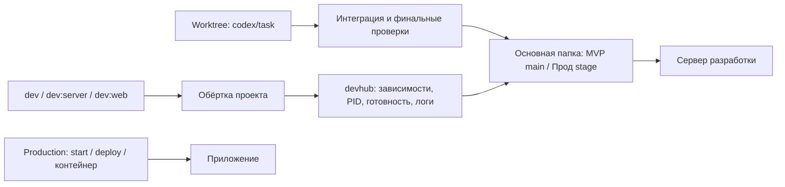

# Пульт

Одна страница, откуда запускаются серверы разработки всех проектов на этом компьютере и открываются
их веб-интерфейсы: MediaPipes, студия сцен Montage, Inference, Modeler, Luv Club, Алтай и остальные.

## Контракт разработки и production

Devhub — единственный менеджер локальных dev-процессов. Основная папка проекта служит стендом
разработки и финальной проверки: `main` в режиме MVP, `stage` в режиме Прод. Каждый проект хранит `devhub.json`
с исходными командами сервисов, портами, зависимостями и группами запуска. `services.json` задаёт настройки
этого компьютера и папки `discover`; при старте пульт находит контракты соседних проектов.



- `bun run dev`, `npm run dev` и зарегистрированные dev-псевдонимы в приложениях передают запуск в пульт.
  Внутри монорепозитория работают и команды отдельных приложений. Повторный запуск возвращает уже
  управляемый сервис; параллельные запросы не создают второй процесс.
- Linked worktree не включаются в каталог. Их dev-команды запускают основную папку; изменения
  становятся видны после интеграции. Процессный менеджер повторно проверяет основной checkout,
  ветку текущего режима и рабочую папку внутри проекта перед запуском. Старые самостоятельные копии
  перенаправляются через `aliases` в машинном `services.json`.
- `launch.dev` задаёт обычный состав проекта. Другие варианты запуска выбираются отдельно;
  несколько вариантов Expo или студии не запускаются одновременно одной кнопкой.
- `build`, production-`start`, `deploy` и production-контейнеры запускаются средствами самого приложения.
  Production не импортирует код devhub и не требует его установки. `start` Expo и `wrangler dev`
  относятся к разработке и тоже передают запуск в пульт.
- Процессы разработки получают `DEVHUB_ROOT`, `DEVHUB_SERVICE`, `DEVHUB_FRAME_ORIGIN`, `NODE_ENV=development`, UTF-8 и пути
  к исполняемым файлам пакетов. Production не получает эти настройки от пульта.
- Пульт ждёт готовности зависимостей и самого сервиса. Занятый порт и сервер, запущенный извне,
  требуют отдельного переноса: devhub не объявляет их своими и не останавливает автоматически.
- Исходные dev-скрипты сохранены в `.devhub/original-scripts.json`, обёртка — `.devhub/launch.cjs`.
  В Python-проектах есть `.devhub/dev.ps1` и `.devhub/dev.sh`; production CLI остаётся самостоятельным.

Пульт ищется рядом с проектами, через `DEVHUB_ROOT` или `~/.devhub.json`. `bun run install:client`
сохраняет путь к этому пульту; это нужно, например, проектам из `Documents/ChatGPT`.
После изменения `devhub.json` перезапустите сам пульт: запущенные им серверы сохраняются.

## Работа с worktree

В проекте доступны `bun run worktree create <task>`, `integrate <ref>`, `check`, `status`,
`publish`, `mode mvp|prod` и `finish <полный путь>`.
Общий CLI: `bun D:/code/devhub/src/stage.ts <команда> --project <путь|id>`.
Режим, проверки, release-ветка и место временных папок находятся в `.devhub/worktree.json`.

В MVP интеграция собственных изменений задачи идёт сразу в `main`; после финальных проверок
CLI пушит в настроенный remote и выполняет известную `deploy`-команду, если она задана.
Агент проверяет production-версию; разрешение владельца на MVP уже включает выпуск каждой задачи.
В Прод интеграция проходит в `stage`, а выпуск в `main` и прод требует явного разрешения задачи.
Все текущие проекты переводятся в MVP; выбрать Прод можно на странице управления проектом.
Существующая политика без `mode` остаётся Прод до явного переноса.

Прод требует чистые исходную и основную папки; MVP сохраняет непересекающиеся чужие локальные
правки и перед push проверяет как основную папку, так и чистый HEAD `main` в worktree.
Отметка проверки аннулируется при смене
режима, исходников или локального env; провал проверок блокирует публикацию.
Обычные worktree расположены в `D:/worktrees/<project>/<task>`, вне папок проектов `D:/code`.
Агент убирает рабочую папку после задачи, сохраняя незавершённую работу и приватные файлы
в recovery-архив при необходимости; Codex-managed папки архивируются через приложение.
Имеющиеся локальные правки интегратор не включает в чужой commit и не публикует автоматически.
Подробный порядок и защита данных: [WORKTREES.md](WORKTREES.md).

`bun scripts/project-modes.ts` показывает перенос подключённых проектов в MVP; `--apply`
меняет политику и owner-блок инструкций с проверкой истории веток. Это не push и не deploy.

## Терминал

Из `D:/code/devhub`:

```text
bun run hub list
bun run hub check
bun run hub status
bun run hub start altay/site
bun run hub start luvclub
bun run hub stop altay/site
bun run hub restart altay/site
bun run hub logs altay/site --lines 50
bun run hub attach altay/site
bun run hub create bts my-app
bun run hub prod altay --logs
```

`--json` у `list` и `status` выдаёт машиночитаемый результат. `start` возвращает успех после готовности
сервиса; ошибка запуска или зависимости возвращает ненулевой код. `stop` и `restart` из CLI действуют
только на процессы пульта. Логи находятся в `.logs`.

## Миграция локальных запусков

`bun run project:interfaces` показывает недостающие ссылки на проверенные веб-интерфейсы,
`bun run project:interfaces --write` добавляет их в `devhub.json` основных папок на `stage`.
Команда сохраняет пользовательские ссылки и проверки готовности, проверяет маршруты по исходникам
и блокирует конкурирующие stage-операции. Оригиналы и хеши записываются в
`.state/migrations/project-management-20261003/interfaces`. Повторный запуск без `--write`
должен показать `changes: 0`.

`bun run migrate` показывает план, `bun run migrate --write` применяет его. Скрипт повторяемый:
сохраняет первые исходные команды и не перезаписывает изменённую вручную команду без проверки.
Архивные копии, артефакты и GPU-инструменты, которыми управляет Inference, не становятся отдельными
серверами разработки. Для другой папки проектов используйте `--root PATH` и добавьте её в `discover`.

`bun run startup:migrate` показывает перевод автозапусков Inference и Predict Paper на пульт,
`bun run startup:migrate -- -Apply` применяет его с резервной копией реестра и задачи в
`.state/startup-backup`. Восстановление: тот же PowerShell-скрипт с `-Restore PATH -Apply`.
Он меняет последующие запуски и не прерывает текущие процессы. Очередь Inference запускается с её
треем и парными исполнителями внутри дерева процесса пульта; перезапускать её следует после
окончания активных задач. Production-задачи и отдельные production-воркеры сохраняют свой запуск.
Прежний повторный запуск Predict Paper через 30 секунд перенесён в управляемый launcher:
`restart: "always"`, `restartDelayMs: 30000`. Для остальных сервисов перезапуск по умолчанию ручной.
Сервис теперь `predict/runtime`; исходники запускаются из `D:/code/predict`, прежний каталог
данных задаётся явно. DevHub запускает конечный `predict.runtime`, а подготовка через
`predict.local up` остаётся самостоятельным entrypoint приложения.

## Как открыть

- Ярлык «Пульт» на рабочем столе или значок в трее (цветное кольцо). Щелчок по значку открывает пульт в браузере.
- Без трея: двойной щелчок по `Пульт.cmd`. Если пульт ещё не работает, он поднимется в фоне, без окна, и откроется
  страница http://127.0.0.1:4700/.
- Или в терминале, в этой папке:
  - `bun run open` — то же, что `Пульт.cmd`; с `--no-browser` только поднимает пульт;
  - `bun run start` — пульт в этом терминале;
  - `bun run dev` — для правки самого пульта: страница обновляется сама.

## Значок в трее, автозапуск и ярлык

`bun run tray:install` собирает маленькую программу `tray\bin\Пульт.exe` (компилятором C#, который есть в самой
Windows), кладёт ярлык «Пульт» на рабочий стол, включает запуск при входе в Windows и запускает значок.
Повторный запуск обновляет всё это; `bun run tray:uninstall` убирает значок, автозапуск и ярлык.

- Значок сам поднимает пульт и следит за ним: если пульт упал, через полминуты поднимает снова (три попытки за пять
  минут, потом говорит об этом и ждёт). Пока пульт не отвечает, кольцо серое.
- Щелчок по значку — открыть пульт. Меню: «Открыть пульт», что сейчас с пультом, «Перезапустить пульт», «Папка
  с логами», «Запускать при входе в Windows», «Выход».
- «Выход» убирает значок и останавливает пульт; серверы проектов, запущенные из пульта, продолжают работать, и
  пульт найдёт их, когда его откроют снова.
- Ярлык на рабочем столе открывает пульт; если значка в трее ещё нет, он появится.
- Код программы — `tray\Tray.cs`, скрипты установки — `scripts\install-windows.ps1` и `scripts\uninstall-windows.ps1`.

## Что на странице

Состав проектов и связи с данными описаны в [PROJECTS.md](PROJECTS.md).

- Слева все проекты и их сервисы. Цвет точки: зелёный — работает, запущен из пульта; синий — работает, но запущен
  не из пульта; жёлтый мигающий — запускается; оранжевый — порт занят, а сервис не отвечает как надо; оранжевый
  кружок — порт занят другим сервисом; красный — упал; серый — остановлен.
- «Обзор»: что работает сейчас; карточки проектов с кнопками запуска dev, остановки и удаления; базы в Docker
  с кнопками «Поднять» и «Остановить»; кто слушает какие порты.
- Страница проекта: режим MVP/Прод, основная папка, текущая ветка, основной интерфейс, dev-сервисы и удаление с диска.
  «Запустить dev» использует группу `launch.dev` из контракта проекта; альтернативные сервисы запускаются отдельно.
- Страница сервиса: его страницы прямо внутри пульта (H3/Qwen MediaPipes, студия сцен Montage…),
  лог в реальном времени и сведения: команда, папка, кто держит порт. Открытые страницы не перезагружаются при
  переключении вкладок. При проверке встраивания пульт учитывает свой адрес, порт и разрешённые CSP origins.
  Если сайт действительно запрещает встраивание, остаётся кнопка открытия в отдельной вкладке.

`DEVHUB_FRAME_ORIGIN` содержит точный HTTP origin работающего пульта, включая настроенный порт
или `--port`. Пульт задаёт его сам; переменная из конфигурации сервиса не может подменить этот адрес.
Приложение может разрешить этот origin и `localhost` на том же порту в `frame-ancestors` только
при управляемом dev-запуске. Самостоятельный production-запуск сохраняет собственную политику.
Встроенная страница использует свой API и прежнюю авторизацию; пульт не переписывает её заголовки.

## Избранное и сворачивание

Звёздочка в карточке, боковом списке или на странице проекта добавляет его в избранное. Избранные проекты
всегда отображаются первыми. Карточки обзора и группы бокового списка можно сворачивать независимо;
при сворачивании остаются название, состояние и ссылка на интерфейс. Настройки сохраняются в браузере.

## Удаление проекта

Кнопка «Удалить проект» есть в карточке и на странице проекта. Перед удалением пульт показывает точные
абсолютные пути: основную папку, существующие Git worktree и связанные копии из `services.json.aliases`.
Одно подтверждение удаляет содержимое всех перечисленных папок, включая локальные изменения и данные.
Процессы проекта, запущенные пультом, сначала останавливаются; список проектов обновляется сразу.

Общие Docker volumes и внешние папки, на которые указывают junction и символические ссылки, сохраняются.
Если другой проект использует удаляемый сервис или файлы, пульт показывает зависимость и блокирует удаление
до переноса данных и обновления конфигурации. Сам пульт, системные каталоги и корни коллекции защищены.
Изменение папок или конфигурации после открытия диалога требует обновить список перед подтверждением.
Результат записывается в `.logs/actions.log`, состояние удаления — в `.state/deletions/<id>.json`.

## Как пульт запускает и останавливает

- Сервер запускается скрыто, без окна; всё, что он пишет, попадает в `.logs/<проект>-<сервис>.log`. Он живёт
  отдельно от пульта: пульт можно закрыть и открыть снова, он найдёт свои серверы.
- Перед запуском пульт поднимает то, что сервису нужно: другие сервисы и базы в Docker (например, Postgres Montage).
  Если порт уже занят, сервис не запускается, а пульт говорит, кто этот порт держит.
- «Остановить» гасит сервер вместе со всем, что он запустил. Сервер, запущенный не из пульта, и контейнеры Docker
  останавливаются только после вопроса.
- Каждое нажатие и его итог записываются в `.logs/actions.log`.
- Пока страница пульта не открыта, он никого не опрашивает, только следит за своими серверами. С открытой
  страницей спрашивает проверку здоровья сервисов раз в 10 секунд, чтобы не засорять их логи.

## Пересекающиеся порты

Несколько проектов и их рабочие копии используют 3000 для API, 3001 для веб-интерфейса и 5432 для Postgres.
Например, 3000 используют Montage, Modeler, Luv Club, CRM Земстрой и Gameradar. Пульт резервирует порт на время
запуска и отказывает следующему сервису, если порт уже занят; владелец показан на странице сервиса.
Порты контрактов согласованы с текущими числовыми настройками приложений. Для совместного запуска проектов
задайте отдельные порты в devhub.json вместе с адресами API и CORS соответствующего приложения.

## Как добавить сервис

Создайте `devhub.json` в корне проекта. Проект: `id`, `name`, при необходимости
`compose` — файл Docker Compose, имя проекта в Docker и какие его сервисы нужны для разработки. Сервис:

- `id`, `name`, `description`;
- `command` — чем запускать; без неё пульт только следит за сервисом;
- `port` и `health` — адрес, который отвечает, когда сервис готов;
- `ui` — страницы сервиса: подпись и путь;
- `needs` — что поднять раньше: `проект/сервис` или `docker:<имя проекта в Docker>`;
- `env`, `cwd` — переменные и папка внутри проекта;
- `warn` — что сказать перед запуском (тратит деньги, держит видеокарту, нужен секрет…).
- `restart`, `restartDelayMs` — политика повторного запуска: `never`, `on-failure` или `always` и пауза.

`compose.overrides` перечисляет файлы разработки после основного Compose-файла. Например,
Gameradar использует `docker-compose.dev.yml`, чтобы открыть базы локальному dev-серверу;
пульт поднимает только `postgres` и `redis`, без production-приложения.

`launch` сопоставляет публичную команду со списком сервисов, например
`"launch": { "dev": ["server", "web"], "dev:server": ["server"] }`.
`cwd` задавайте относительно корня проекта. Корень определяется по расположению контракта;
абсолютные пути к другим компьютерам в контракт не добавляйте. Dev-обёртку можно взять из
`templates/launch.cjs`. `services.json` поддерживает старые явные записи, но контракт проекта
заменяет старую запись с тем же `id`.

Пульт читает список при запуске; после правки перезапустите его.

## Безопасность

- Пульт слушает только 127.0.0.1 и отвечает только на своём адресе; кнопки работают только с его собственной
  страницы.
- Управление сервисами запускает те же команды, что вы запустили бы в терминале. Сервисы,
  которые тратят деньги (MediaPipes для Montage на RunPod) или держат видеокарту (очередь Inference), помечены
  предупреждением.

## Агенты работают через пульт

Claude Code, Codex и другие агенты запускают dev-серверы только через DevHub:
`bun D:/code/devhub/src/cli.ts start|stop|restart|status|logs|attach`. `bun run agents` показывает план,
`bun run agents --write` применяет его:

- блок `DEVHUB:DEV-SERVER` в `D:/code/AGENTS.md`, `~/.claude/CLAUDE.md` и `~/.codex/AGENTS.md` —
  правила и команды пульта; остальной текст файлов сохраняется;
- hook `PreToolUse` в `~/.claude/settings.json` (`src/agent-guard.ts`): внутри проекта с `devhub.json`
  он отклоняет `next dev`, `vite`, `bun --hot`, `node --watch`, `turbo dev`, `uvicorn --reload`, `expo start`
  и подобные команды, а также `preview_start` для записи `.claude/launch.json`, которая запускает сервер сама.
  Сборки, тесты и `bun run dev` проходят; при ошибке hook ничего не блокирует;
- с `--projects` — тот же блок в AGENTS.md каждого проекта и `.claude/launch.json`, где превью запускается
  через `cli.ts attach <проект>/<сервис>`: сервис стартует в пульте, а команда только показывает его лог.
  Прежняя конфигурация с самостоятельным запуском сохраняется в `.devhub/original-claude-launch.json`.
  Это правки репозиториев проектов: их коммит и выпуск идут по правилам режима каждого проекта.

`logs <проект>/<сервис> [--lines N]` печатает конец лога из `.logs`, `attach` запускает сервис и следит
за логом; Ctrl+C отключает только вывод.

## Новый проект

«+ Новый проект» в боковом списке или `bun run hub create bts|python ИМЯ [--description ТЕКСТ] [--no-web]`.
Проект создаётся в папке `code` из `services.json` и сразу появляется в пульте:

- **Better-T-Stack** — `create-better-t-stack create-json`: Next.js, Hono на Bun, tRPC, Better Auth,
  Drizzle + Postgres в Docker, Turborepo, Biome/Ultracite, lefthook, evlog, skills и MCP, Dockerfile для
  web и server. Как у analytics и brains.
- **Python** — чистый проект на uv: пакет в `src/`, pytest, ruff; по умолчанию FastAPI с `/health`
  и Dockerfile, с `--no-web` — пакет без dev-сервиса.

Пульт выбирает свободные порты (приложения с 3020, Postgres с 5433, Python API с 8100), пишет их в
`devhub.json`, `.env` и `docker-compose.yml`, заменяет dev-скрипты обёртками, сохраняет исходные в
`.devhub/original-scripts.json`, создаёт политику MVP с `remote: null`, AGENTS.md с правилами,
`.claude/launch.json` и первый коммит в `main`. Remote, Coolify и деплой подключаются отдельно.
Если код шаблона ещё не проходит Ultracite, `bun run check` не входит в финальные проверки,
пока замечания не исправлены.

## Прод (Coolify)

Раздел «Прод» и блок на странице проекта показывают, что работает в Coolify: статус и домены приложений,
коммит, последние деплои, логи, базы и сервисы проекта, ссылки в консоль Coolify. Пульт только читает:
он не деплоит и не перезапускает. В терминале: `bun run hub prod [проект] [--logs] [--lines N] [--json]`.

```json
"coolify": { "url": "https://deploy.balkhaev.com", "tokenEnv": "COOLIFY_ACCESS_TOKEN", "links": {} }
```

Токен берётся из переменной окружения (на Windows также из пользовательских переменных) и не уходит
на страницу; страница получает только выбранные поля без секретов, переменных и логов сборки.
Приложения сопоставляются с проектами по git-репозиторию, затем по имени проекта Coolify;
`links` задаёт явную связь: `"montage": ["<uuid приложения>", "<имя проекта Coolify>"]`.

## Проверка кода

`bun run check` — типы и Ultracite; `bun test` — проверки конфигурации, discovery, CLI, делегирования,
готовности, владения процессами и конкурентного запуска. `bun run hub check` проверяет контракты
всех подключённых рабочих каталогов.

## Claude и Codex

В разделе **Claude и Codex** можно подключить несколько личных подписок и использовать DevHub как локальный AI-прокси. Он распределяет запросы между аккаунтами, учитывает приоритет, занятость и лимиты, поддерживает псевдонимы моделей и отдельные ключи приложений. Доступны OpenAI Chat Completions/Responses и Anthropic Messages, потоковые ответы и вызовы инструментов.

Адрес OpenAI SDK — `http://127.0.0.1:4700/v1`, Anthropic SDK — `http://127.0.0.1:4700`. Каталог и запросы проходят через DevHub: `GET /api/ai/models` собирает модели подключённых аккаунтов и результаты их проверки, `?refresh=1` обновляет каталог. SDK получает разрешённые его ключу модели через `GET /v1/models` или `client.models.list()`. Устаревшие результаты отмечены в интерфейсе и не выдаются как актуальные модели SDK.

Вкладка **Прокси** создаёт ключ приложения и показывает примеры настройки. Провайдер выбирается моделью `codex/<модель>`, `claude/<модель>` или псевдонимом; аккаунт можно закрепить явно. Данные подписок шифруются локально, ключи приложений сохраняются только как хеши. Подключение OpenAI использует официальный Sign in with ChatGPT; доступ Claude из стороннего приложения определяет Anthropic. [Подключения, доступные модели, API, исследование OmniRoute и ограничения](AI.md).
